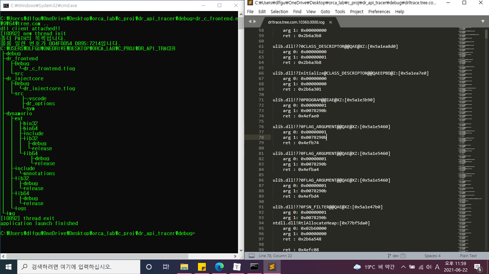

# dr_api_tracer
> x86 Console Application API Tracer





## Reference

This tool use function which parse and map API Symbol implemented in *[@drltrace](https://github.com/mxmssh/drltrace.git)*

But, Implement more effective API instrumentation mechanism.

So you can trace API call without logging subroutine API call and don't have to use White/Black List for filtering.


## Development setup

To develop this tool in VSStudio, you need followings

- [ ] **VisualStudio 2017**, `2019 may cause error`

- [ ] **Dwonload Dynamorio** *[@here](https://github.com/DynamoRIO/dynamorio/releases/download/cronbuild-8.0.18796/DynamoRIO-Windows-8.0.18796.zip)* and locate it on *dynamorio* directory

- [ ] Setting environment variable for load Dynamorio DLLs

  


## Usage

This tool support only **x86 ConsoleApplication**

If want to check reason why doesn't support GUI, check *[@here](https://groups.google.com/g/dynamorio-users/c/2cAuAhIBR8Y)*

```sh
dr_c_frontend.exe -- [target_app] [target_app_options]
```


## Todo

- [ ] Make sure about thread-safe
- [ ] CMAKE Build
- [ ] 64bit application support
- [ ] GUI application support